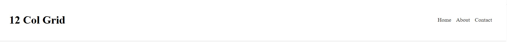
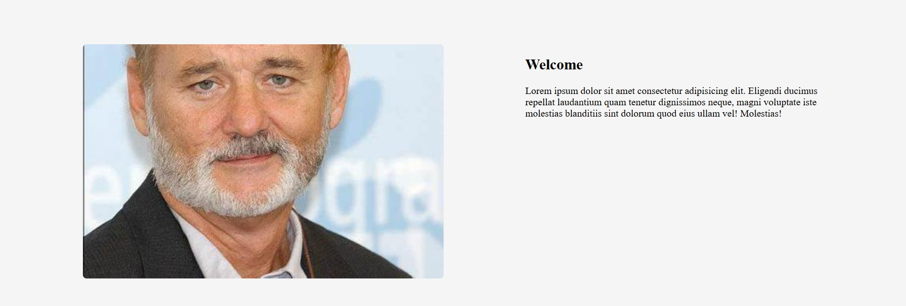
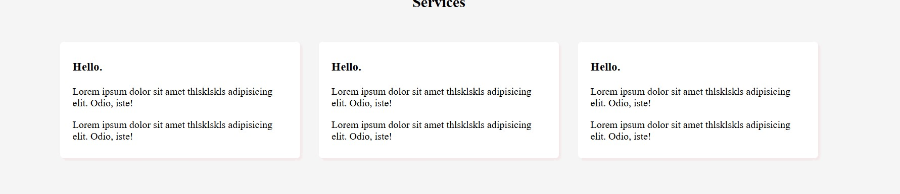

# 12colgrid
12 columns width

in this web it shows how 12 grid web split the columns into 12 each has equal section with the 1fr (one fraction ).

# Header
header it has two parts the title and list of nav bar and the whole header split into 12 
with the following css instruction 
       .grid {
               display: grid;
               grid-template-columns: repeat(12,1fr);
               gap: 30px;
             }
and the title and nav list split the section in to two equal section
       header h1 {
                  grid-column: span 6;
                  }
       header nav {
                  grid-column: span 6;
                  justify-self: end;
                  }
justify-self end move the list of nav to the end 
span 6 it shows that section cover only 6 fraction 
the nav bar looks like this

when we come to the main section 
in the first section it has image and welcome message . the image cover the first 6 columns 
and the message cover the rest but it start from 8 and goes the remain  5 columns

main img {
  grid-column: span 6;
  width:100%;
  border-radius:6px
}

main .welcome {
  grid-column: 8/span 5 ;
}

The last part is the card it divide the section into three equal part with white background and 
with the given box-shadow and padding

main .card {
  grid-column: span 4;
  background: #fff;
  padding: 10px 20px;
  border-radius: 6px;
 box-shadow: 3px 3px 3px rgba(0, 0, 0, 0.05);
}

# bisrat
 may 29, 2024 4:51 PM Dallas,Tx
